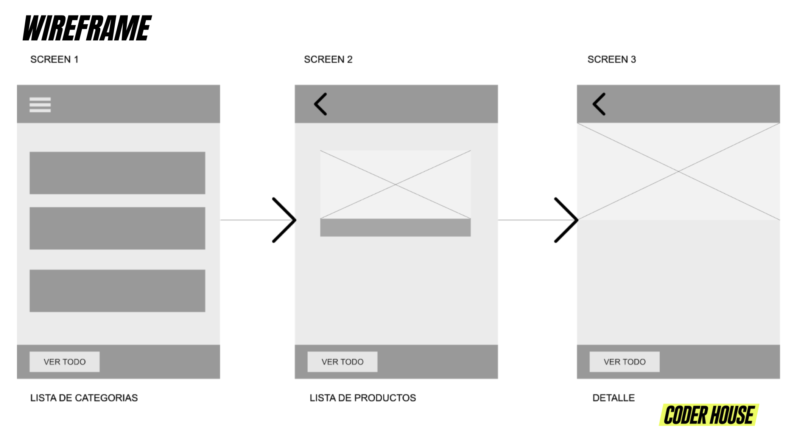

# Panaderia

Aplicación de tienda de panadería.

Pantallas:
- Lista de categorías.
- Lista de productos.
- Detalle del producto.

## Usar la aplicación

1. Clona este repositorio
2. Desde la carpeta del proyecto, ejecuta el comando ```npm install``` para instalar todas las dependencias
3. Desde la carpeta del proyecto, ejecuta el comando ```npm start``` para inicializar expo
4. Desde el dashboard de expo, selecciona la acción "Run on Android device/emulator" ó "Run on iOS device/simulator" para comenzar a utilizar la aplicación

Las ramas del proyecto están organizadas según la clase y el tema.
La rama main estará siempre actualizada a la última clase vista.

## Wireframe


